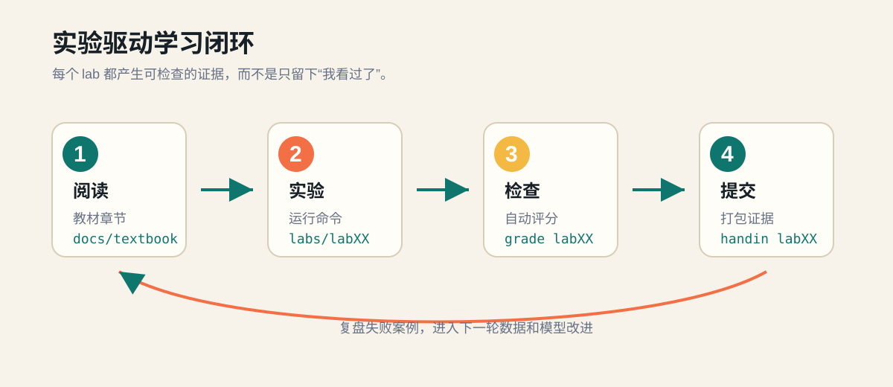
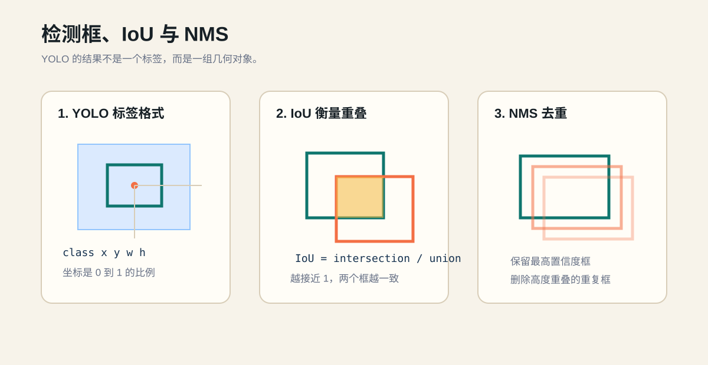
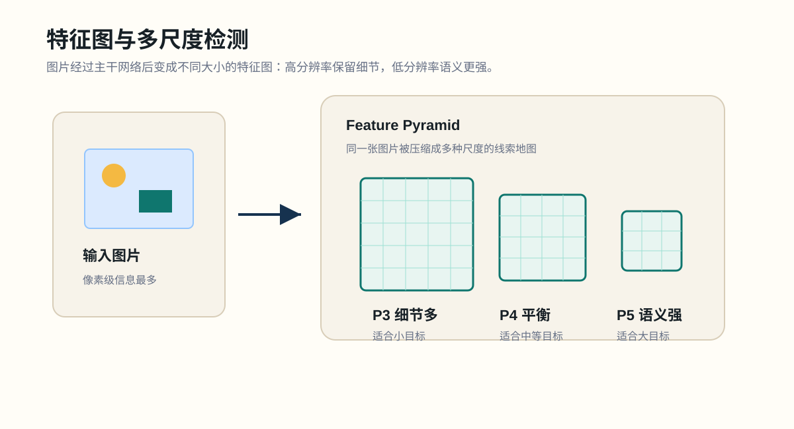
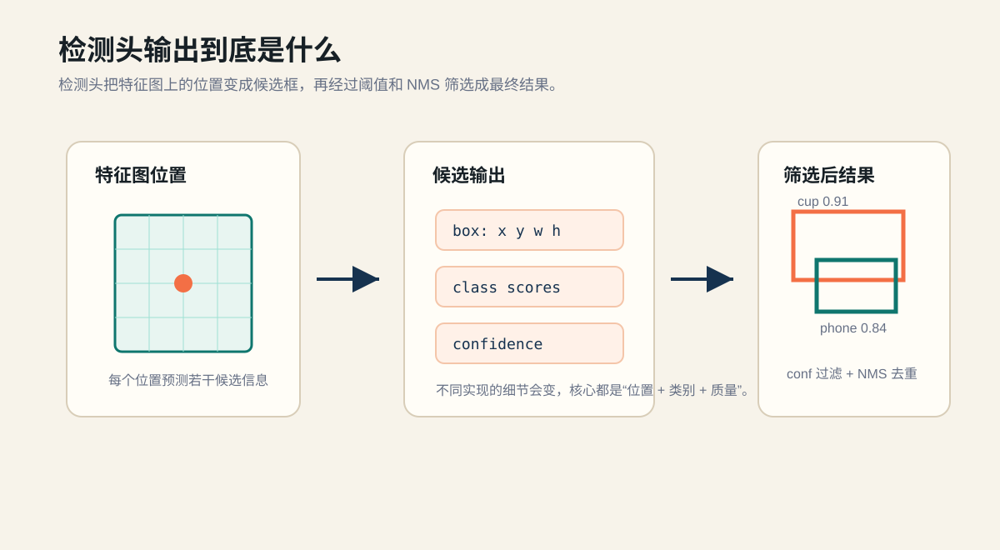
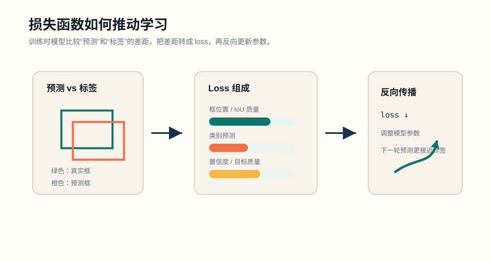
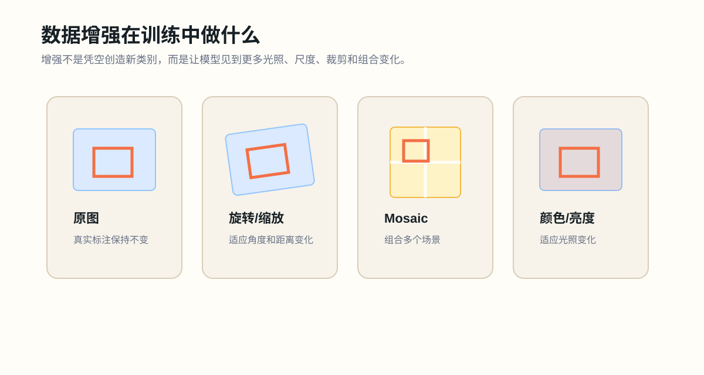
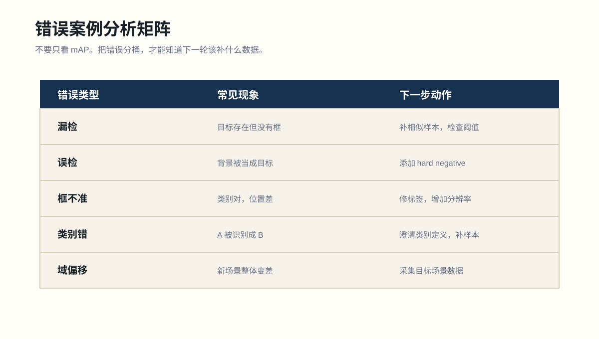
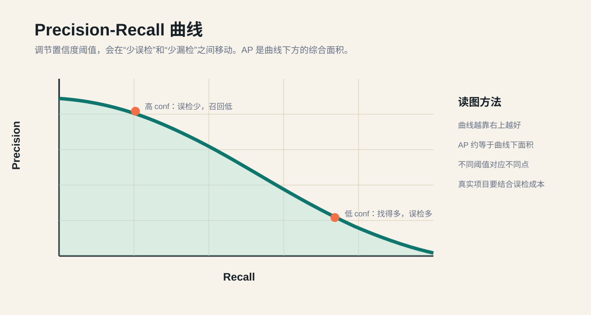

# YOLO 模型教材

版本日期：2026-05-22

这是 YOLO Learning Lab 的中文教材。它面向没有模型经验的学习者，默认你本地电脑配置一般，因此课程采用 **本地轻量学习 + 云端训练/部署** 的路线：本地负责写代码、整理数据、记录实验；云端负责训练、批量评估和在线演示。

英文版教材保留在 [yolo_model_textbook.md](yolo_model_textbook.md)。两份教材内容目标一致，但中文版会更贴近本课程的中文 lab 说明。

## 目录

- 第 0 章：如何使用这本教材
- 第 1 章：计算机视觉与目标检测
- 第 2 章：检测框、IoU 与 NMS
- 第 3 章：YOLO 模型到底在做什么
- 第 4 章：运行预训练模型预测
- 第 5 章：构建 YOLO 数据集
- 第 6 章：云端训练
- 第 7 章：验证、指标与错误分析
- 第 8 章：导出与部署
- 第 9 章：工程化一个 YOLO 项目
- 第 10 章：最终项目要求
- 附录 A：常用公式
- 附录 B：命令速查
- 附录 C：术语表
- 附录 D：学习检查问题
- 附录 E：参考资料

---

## 第 0 章：如何使用这本教材

学习 YOLO 最容易踩的坑，是一上来就问“模型结构是什么”“论文怎么读”“怎么调参”。这些当然重要，但对初学者来说，更可靠的路线是先把 YOLO 当成一个完整系统：

```text
图片 -> 标注 -> 数据集配置 -> 模型训练 -> 预测结果 -> 指标 -> 错误案例 -> 数据改进 -> 部署
```

这本教材按这个顺序展开。每一章都对应一个或多个实验：



| 教材章节 | 对应实验 | 主要能力 |
| --- | --- | --- |
| 第 1 章 | `lab00` | 搭建本地环境和课程工具 |
| 第 2 章 | `lab01` | 理解检测框、IoU、NMS |
| 第 3-4 章 | `lab02` | 用预训练模型做预测 |
| 第 5 章 | `lab03` | 构建和检查 YOLO 数据集 |
| 第 6 章 | `lab04` | 在云端训练自定义模型 |
| 第 7 章 | `lab05` | 验证模型并分析错误 |
| 第 8 章 | `lab06`、`lab07` | 导出、推理和部署 |
| 第 9-10 章 | `lab08` | 完成最终项目 |

### 这门课的学习方式

它更像实验课，而不是视频课。每个 lab 都要求你：

1. 阅读教材。
2. 打开 `labs/labXX/README.md`。
3. 完成 `submissions/labXX/` 里的提交模板。
4. 运行 `python tools/course.py grade labXX`。
5. 修改直到通过。
6. 运行 `python tools/course.py handin labXX` 打包。

轻量 grader 不会判断你的模型是否“真的好”，它只检查结构、必填项和明显占位符。真正的质量判断来自你的错误分析和复盘。

### 最重要的习惯

记录证据。

每次运行实验，都记录：

- 运行了什么命令
- 输入文件在哪里
- 输出文件在哪里
- 报错是什么
- 指标是多少
- 哪些图片失败了
- 下一步要改什么

这就是从“我试了一下”变成“我做了一个可复现实验”的分界线。

### 读这本书时应该慢在哪里

初学 YOLO 时，不需要在第一天就完全理解神经网络内部的每一层。更重要的是先建立三层直觉：

第一层是输入输出直觉。你要知道模型吃什么文件，输出什么文件，输出里的每个数字代表什么。

第二层是数据直觉。你要能看出一批图片和标签是否适合训练：类别是否清楚、标注是否一致、训练集和验证集是否来自相似场景。

第三层是实验直觉。你要能回答“这次模型变好或变差，最可能是因为什么”。如果你一次改变太多东西，就会失去这种判断力。

所以读教材时，遇到命令不要只复制运行。至少问自己三件事：

- 这个命令的输入是什么？
- 它会把输出写到哪里？
- 如果结果不好，我下一步应该检查数据、参数还是部署环境？

---

## 第 1 章：计算机视觉与目标检测

计算机视觉的目标，是让程序从图像或视频中提取结构化信息。常见任务包括：

| 任务 | 问题 | 输出 |
| --- | --- | --- |
| 图像分类 | 这张图主要是什么？ | 一个或多个类别 |
| 目标检测 | 图里有哪些物体，它们在哪里？ | 检测框、类别、置信度 |
| 实例分割 | 每个物体具体占哪些像素？ | 每个实例的 mask |
| 语义分割 | 每个像素属于哪个类别？ | 像素级类别图 |
| 姿态估计 | 人体或物体关键点在哪里？ | 点和骨架 |

YOLO 最常用于 **目标检测**。目标检测比分类更难，因为它同时要解决两个问题：

- 分类：这个物体是什么？
- 定位：这个物体在哪里？

一张图里可能有多个物体，所以检测模型还要处理“有几个”“每个在哪里”“是否重复框出同一个物体”等问题。

### 从像素到结构化结果

图片在计算机里本质上是数字矩阵。彩色图片通常有红、绿、蓝三个通道，每个像素都有三个亮度值。人看到的是“杯子、桌面、阴影”，模型最开始看到的只是数字。

神经网络要做的事情，是把这些低层数字逐步变成高层线索：

```text
像素亮度 -> 边缘/颜色 -> 局部纹理 -> 物体部件 -> 完整目标 -> 类别和位置
```

目标检测的输出不是一句话，而是一张结构化表：

| class | confidence | x_center | y_center | width | height |
| --- | --- | --- | --- | --- | --- |
| cup | 0.91 | 0.52 | 0.48 | 0.18 | 0.31 |
| phone | 0.77 | 0.71 | 0.62 | 0.20 | 0.12 |

这张表的每一行就是一个候选目标。你后面看到的阈值过滤、NMS、指标计算，本质上都在处理这张表。

### 分类、检测和分割的边界

如果你的问题是“图里有没有安全帽”，分类可能足够。

如果你的问题是“每个人头上有没有安全帽，并指出没戴的人在哪里”，检测更合适。

如果你的问题是“把安全帽的每个像素轮廓精确抠出来”，分割更合适。

YOLO 家族也有检测、分割、姿态等不同任务形态。本课程先学习检测，因为检测最能代表工程里的完整闭环：数据标注、模型训练、指标评估、部署推理都会遇到。

### 什么适合作为检测类别

好的初学者类别应该满足：

- 视觉边界清楚
- 容易用矩形框标注
- 类别之间差异明显
- 样本容易收集
- 真实使用场景明确

例如：

- 手机
- 杯子
- 鼠标
- 安全帽
- 车辆
- 某种水果

不适合初学者的类别通常有：

- 概念太抽象，如“危险物品”
- 需要上下文判断，如“有用的工具”
- 目标太小
- 边界模糊
- 类别差别只体现在文字或极细纹理上

### 本地轻量 + 云端训练

如果你的本地电脑配置不强，不要强行本地训练。合理分工是：


| 环节 | 推荐位置 |
| --- | --- |
| 写代码 | 本地 |
| 写笔记 | 本地 |
| 数据整理 | 本地 |
| 少量图片预测 | 本地或 Colab |
| 模型训练 | Colab / Kaggle / 云 GPU |
| 批量验证 | 云端 |
| 在线 demo | Hugging Face Spaces / Roboflow / 云端 |

学习 YOLO 的重点不是让本地电脑跑满，而是理解完整流程。

---

## 第 2 章：检测框、IoU 与 NMS

目标检测模型输出的是一组矩形框。每个框通常包含：

- 类别 class
- 位置 box
- 置信度 confidence

### 检测框格式

常见框格式有两种：

| 格式 | 含义 |
| --- | --- |
| `xyxy` | 左上角 x、左上角 y、右下角 x、右下角 y |
| `xywh` | 中心点 x、中心点 y、宽度、高度 |

YOLO 标签文件使用的是归一化后的 `xywh`：

```text
class_id x_center y_center width height
```

例子：

```text
0 0.500 0.420 0.200 0.300
```

意思是：

- 类别 id 是 `0`
- 框中心在图片宽度 50% 处
- 框中心在图片高度 42% 处
- 框宽度是图片宽度的 20%
- 框高度是图片高度的 30%

归一化的好处是标签不依赖具体图片尺寸。

### 像素坐标和归一化坐标的手算例子

假设图片大小是 `1280 x 720`，某个杯子的像素框是：

```text
左上角 (x1, y1) = (384, 180)
右下角 (x2, y2) = (640, 540)
```

先算像素尺度下的中心点和宽高：

```text
x_center_px = (384 + 640) / 2 = 512
y_center_px = (180 + 540) / 2 = 360
width_px = 640 - 384 = 256
height_px = 540 - 180 = 360
```

再除以图片宽高，得到 YOLO 标签：

```text
x_center = 512 / 1280 = 0.400
y_center = 360 / 720 = 0.500
width = 256 / 1280 = 0.200
height = 360 / 720 = 0.500
```

如果杯子的 `class_id` 是 `1`，标签文件里这一行就是：

```text
1 0.400 0.500 0.200 0.500
```

很多初学者的数据问题都来自这里：把 `xyxy` 当成 `xywh`、忘记归一化、或者把图片宽高顺序写反。

### IoU：交并比

IoU 全称是 Intersection over Union，中文常叫交并比。

公式：

```text
IoU = 两个框的交集面积 / 两个框的并集面积
```

如果两个框完全不重叠，IoU = 0。  
如果两个框完全一致，IoU = 1。

IoU 用在三个地方：

- 判断预测框是否匹配真实框
- 衡量框的位置质量
- 在 NMS 中去掉重复框

### 一个直观的 IoU 数字例子

假设两个框的面积都是 `100`，它们重叠的面积是 `60`。并集不是 `100 + 100`，因为重叠部分被算了两次，所以：

```text
union = 100 + 100 - 60 = 140
IoU = 60 / 140 = 0.429
```

这说明两个框看起来重叠不少，但 IoU 还不到 `0.5`。当你看到 `mAP50` 或 `IoU=0.5` 这样的指标时，要知道它其实是在问：预测框和真实框的重叠程度是否超过一个最低门槛。

### 置信度 confidence

置信度是模型对一个检测结果的信心。注意：

> 高置信度不等于框一定准。

一个检测可以类别很自信，但框很松。也可以框住了目标，但类别错了。

提高 `conf` 阈值通常会：

- 减少预测框
- 减少误检
- 增加漏检风险

降低 `conf` 阈值通常会：

- 增加预测框
- 找到更多低置信度目标
- 增加误检

### NMS：非极大值抑制

模型可能对同一个物体输出多个重叠框。NMS 的作用是保留最强的框，去掉重复框。

简化过程：

1. 按置信度从高到低排序。
2. 保留最高置信度框。
3. 删除与它高度重叠的低置信度框。
4. 对剩余框重复这个过程。

NMS 解决的是“重复框”问题，不解决“类别定义不清楚”或“训练数据不足”的问题。



### 阈值应该怎么理解

YOLO 推理时经常会看到两个阈值：`conf` 和 `iou`。

`conf` 决定“候选框够不够自信”。调高它，模型会少报；调低它，模型会多报。

`iou` 常用于 NMS，决定“两个框重叠到什么程度才算重复”。如果 `iou` 太低，靠得近的两个真实目标可能被误删；如果 `iou` 太高，同一个目标可能留下多个重复框。

不要把阈值当成魔法数字。更好的做法是拿一小批验证图片做对比表：

| 设置 | 现象 | 适合场景 |
| --- | --- | --- |
| 低 `conf` | 找得多，误检也多 | 宁愿多报也不要漏报 |
| 高 `conf` | 报得少，更保守 | 误检成本高 |
| 低 NMS `iou` | 重复框少，但近邻目标可能被合并 | 目标稀疏 |
| 高 NMS `iou` | 近邻目标更容易保留，但重复框可能增加 | 目标密集 |

---

## 第 3 章：YOLO 模型到底在做什么

YOLO 是 You Only Look Once 的缩写。它的核心思想是：模型只看一遍整张图，就同时预测物体类别和位置。

实际工程中，你可以把 YOLO 理解成：

```text
输入图片 -> 特征提取 -> 多尺度融合 -> 检测头预测 -> 后处理 -> 输出框
```


### Backbone、Neck、Head

虽然你不需要从零实现 YOLO，但需要知道三个概念：

Backbone：主干网络，用来提取图像特征，例如边缘、纹理、形状、部件。

Neck：特征融合部分，用来结合不同尺度的信息。小目标和大目标依赖的特征尺度不同。

Head：检测头，输出类别、框位置和置信度。

后处理：包括阈值过滤、NMS、结果格式化等。

### 特征图的直觉

模型不会一直在原图上逐像素判断“这里是不是杯子”。它会把图片变成一组更小、更抽象的特征图。特征图可以粗略理解为很多张“线索地图”：有的图对边缘敏感，有的图对纹理敏感，有的图对某种形状组合敏感。



大目标通常可以在较低分辨率、语义更强的特征图上被识别；小目标则更依赖高分辨率细节。所以现代 YOLO 往往会融合多个尺度的特征。你不必背每个模块名，但要记住一句话：

```text
检测小目标需要细节，识别大目标需要语义，多尺度融合就是把两者接起来。
```

### 检测头到底输出什么

检测头不是直接输出“一张带框图片”，而是先输出大量候选结果。你可以把每个候选结果理解为：

```text
候选框位置 + 类别分数 + 目标质量/置信度
```



模型会在多个特征尺度上产生候选框。后处理再把这些候选框变成人能读懂的检测结果：

1. 删除低于 `conf` 阈值的候选框。
2. 把坐标从模型内部尺度还原到原图尺度。
3. 用 NMS 去掉重复框。
4. 输出最终的 `class, confidence, box`。

不同 YOLO 实现对“目标质量”“类别分数”“框回归”的具体计算会有差异，但工程上你先抓住这个抽象就够了：模型先产生很多候选，再筛选。

### 训练时模型在学什么

训练并不是“把图片记住”。更准确地说，模型在不断调整参数，让自己的预测更接近标签。一次训练样本会贡献几类误差：

- 类别误差：类别预测错了。
- 位置误差：框的位置和真实框不够重合。
- 置信度误差：该有目标的地方不够自信，没目标的地方太自信。



这些误差会被合成一个训练损失。训练日志里的 loss 下降，通常表示模型正在更好地拟合训练数据；但 loss 低不等于模型一定能泛化到新图片，所以还要看验证集指标和错误案例。

更细一点看，训练过程可以分成四步：

1. 前向传播：模型根据当前参数做预测。
2. 计算损失：把预测和真实标签比较，得到 loss。
3. 反向传播：计算哪些参数应该往哪个方向调整。
4. 参数更新：优化器让下一轮预测更接近标签。

loss 不是一个神秘分数，它只是“预测离标签还有多远”的可优化表达。检测任务里，它通常会同时关心框的位置质量、类别判断和目标置信质量。

### 为什么用预训练模型

从零训练模型需要大量数据和算力。初学者通常不这么做。

预训练模型已经从大数据集中学到很多通用视觉能力，例如：

- 边缘
- 角点
- 纹理
- 常见物体部件
- 场景布局

你在自定义数据集上训练时，通常是在预训练模型基础上微调。

### 模型大小

YOLO 模型常见大小包括 nano、small、medium、large、xlarge。一般规律是：

- 越小越快，越适合弱设备
- 越大可能越准，但更吃显存和算力

初学者建议：

1. 先用 nano。
2. 先修数据和标注。
3. 数据质量稳定后再尝试更大模型。

### 版本和实现不用一开始纠结

YOLO 是一个模型家族，不是单一文件。不同实现会有不同的模块、训练策略和导出能力。初学阶段不需要追逐“最新版本”，因为你真正要掌握的是通用工作流：

```text
数据定义 -> 标注 -> 训练 -> 验证 -> 错误分析 -> 导出 -> 部署
```

只要这个工作流清楚，换一个 YOLO 实现也不会从零开始。

---

## 第 4 章：运行预训练模型预测

预测是最安全的第一步，因为它不需要训练。

常用参数：

| 参数 | 含义 |
| --- | --- |
| `model` | 权重文件或官方模型名 |
| `source` | 图片、文件夹、视频、URL、摄像头编号 |
| `conf` | 置信度阈值 |
| `imgsz` | 输入图片尺寸 |
| `save` | 是否保存可视化结果 |

本课程提供脚本：

```powershell
python scripts/predict_image.py --source data/samples --model yolo11n.pt --imgsz 320 --conf 0.25
```

这条命令可以拆成三部分理解：

- `--source data/samples`：告诉脚本从哪里读图片。
- `--model yolo11n.pt`：告诉脚本用哪个预训练权重。
- `--imgsz 320 --conf 0.25`：告诉脚本推理时把图缩放到什么尺寸，以及低于多少置信度的结果不要。

如果本地电脑较弱：

- 使用 nano 模型
- `imgsz` 先用 320 或 416
- 先测图片，不测视频
- 不急着跑摄像头实时检测

### 如何观察预测结果

不要只看“框出来了没有”。你应该问：

- 该出现的目标是否都出现了？
- 有没有把背景误认为目标？
- 框是否太松或太紧？
- 小目标是否漏掉？
- 同一个物体是否被重复框出？
- 置信度和肉眼判断是否一致？

### 预测结果目录怎么读

一次预测通常会生成若干输出：

- 带框图片：最适合肉眼检查。
- 标签或 JSON：适合后续程序读取。
- 日志：包含模型、图片尺寸、耗时、输出目录等信息。

检查顺序建议是：

1. 先看命令是否真的读到了你想要的图片。
2. 再看输出目录是否生成了结果。
3. 然后随机打开 5-10 张预测图。
4. 最后再考虑是否调整 `conf`、`imgsz` 或换模型大小。

如果第一步 source 就错了，后面的指标和可视化都没有意义。

### 一个小型参数实验

同一批图片可以跑三次：

```powershell
python scripts/predict_image.py --source data/samples --model yolo11n.pt --imgsz 320 --conf 0.15
python scripts/predict_image.py --source data/samples --model yolo11n.pt --imgsz 320 --conf 0.50
python scripts/predict_image.py --source data/samples --model yolo11n.pt --imgsz 640 --conf 0.25
```

观察三件事：

- 低 `conf` 是否带来更多误检？
- 高 `conf` 是否造成漏检？
- 更大 `imgsz` 是否改善小目标，但推理更慢？

这比只跑一次命令更有学习价值。

### 预训练模型的局限

预训练模型通常对 COCO 等常见类别效果不错，但对你的自定义场景未必有效。例如：

- 工业零件
- 特定品牌包装
- 小缺陷
- 屏幕 UI 元素
- 非常特殊的摄像头角度

这就是为什么需要自定义数据集。

---

## 第 5 章：构建 YOLO 数据集

YOLO 数据集由三部分组成：

- 图片
- 标签 `.txt`
- 数据集配置 `dataset.yaml`

推荐结构：


```text
data/yolo_dataset/
  images/
    train/
    val/
    test/
  labels/
    train/
    val/
    test/
  dataset.yaml
```

`dataset.yaml` 示例：

```yaml
path: data/yolo_dataset
train: images/train
val: images/val
test: images/test

names:
  0: phone
  1: cup
  2: mouse
```

标签文件示例：

```text
0 0.512 0.433 0.210 0.315
2 0.721 0.602 0.180 0.140
```

每一行代表一个目标。

### 图片和标签如何一一对应

YOLO 数据集里，图片和标签靠“同名文件”对应。例如：

```text
images/train/desk_001.jpg
labels/train/desk_001.txt
```

如果一张图片没有任何目标，通常可以有一个空的 `.txt` 文件，或者按工具约定允许标签缺失。课程里建议保留空标签文件，因为它明确表达“这张图检查过，确实没有目标”。

如果标签文件名拼错，模型不会知道你本来想标哪张图；它只会把这张图片当成没有正确标签的数据。很多训练异常都不是模型问题，而是文件对应关系问题。

### 数据集划分

训练集用于学习。验证集用于观察泛化能力。测试集用于最终评估。

初学者可以用：

- 训练集：70%-80%
- 验证集：10%-20%
- 测试集：10%

如果数据很少，也要保留验证集，但不要过度迷信指标。小数据集上，错误案例分析更重要。

### 标注规则

标注前要写规则。没有规则，标签会越来越乱。

例子：

- 只框可见部分，不框被遮挡但想象中存在的部分。
- 目标至少可见 30% 才标注。
- 小于 12 像素的目标暂不标注。
- 同一类物体统一使用同一个 class id。
- 反光、模糊、遮挡样本要保留一部分，因为真实场景会出现。

### 标注边界的细节

初学者常问“框要贴多紧”。一个实用原则是：框住目标的可见外接矩形，尽量少包含背景，但也不要切掉目标。

几种常见情况：

| 场景 | 建议 |
| --- | --- |
| 目标被遮挡 | 只框可见部分，除非你的项目规则另有说明 |
| 目标有阴影 | 不把阴影算进框 |
| 透明物体 | 框住可见轮廓，规则要写清楚 |
| 目标很小 | 低于规则阈值可以不标，但要统一 |
| 目标被截断 | 如果真实场景会出现截断，应保留并标注可见部分 |

标注的一致性比“某一张图框得极致完美”更重要。模型学习的是统计规律，不是一张图的艺术级精修。

### 数据量多少才够

没有固定答案，但可以用阶段目标判断：

| 阶段 | 图片量 | 目标 |
| --- | --- | --- |
| smoke 数据集 | 10-30 张 | 跑通训练流程，发现路径和格式问题 |
| 初版数据集 | 100-300 张 | 看模型是否学到基本规律 |
| 迭代数据集 | 300-1000+ 张 | 补困难场景，改善泛化 |

如果类别很多，每个类别都需要足够样本。与其第一版做 20 个类别，不如先做 2-3 个定义清楚的类别，把完整流程跑稳。

### 数据增强的作用

训练时常会使用数据增强，例如缩放、裁剪、旋转、颜色扰动、Mosaic 等。



数据增强的目的不是“凭空制造真实数据”，而是让模型在训练时看到更多合理变化：

- 同一个物体可能远一点、近一点。
- 拍摄角度可能略微倾斜。
- 光照可能变亮或变暗。
- 物体可能被裁掉一部分。
- 背景可能和训练集中不同。

但增强不能替代真实数据。如果你的真实场景是夜间监控，而训练集全是白天照片，只靠调亮度增强通常不够。更可靠的做法是收集真实夜间样本。

也不要把增强开得过强。过强增强会制造不自然图片，让模型学习到现实中不会出现的模式。初学阶段建议先使用训练框架默认增强，等错误分析稳定后再微调。

### 常见数据错误

- 图片有标签，标签文件名不匹配
- 标签坐标不是 0 到 1
- class id 超出 `names` 范围
- 漏标目标
- 同一个目标重复标注
- 框太松
- 框太紧
- 训练集和验证集来自完全不同分布

本课程提供检查脚本：

```powershell
python scripts/inspect_dataset.py --data data/yolo_dataset/dataset.yaml
```

### 数据版本

不要不断覆盖数据集。建议命名：

```text
dataset_v0_smoke
dataset_v1_initial
dataset_v2_more_low_light
dataset_v3_fixed_labels
```

每个训练结果都应该能对应到一个数据版本。

### 数据集质量检查清单

在训练前，至少检查：

- `dataset.yaml` 的路径是否能被脚本读到。
- `names` 里的类别数量是否覆盖所有 class id。
- 每张图片是否有对应标签文件。
- 标签坐标是否都在 0 到 1 之间。
- 训练集、验证集是否混入重复图片。
- 验证集是否和真实使用场景接近。
- 是否存在明显漏标和重复标注。

如果数据质量不稳，训练更久通常只是把错误学得更牢。

---

## 第 6 章：云端训练

训练是最吃算力的环节。如果本地电脑弱，直接用云端。


常见选择：

- Google Colab
- Kaggle Notebook
- Ultralytics Cloud Training
- 云服务器 GPU

### 以 Google Colab 为例

Google Colab 入口：

```text
https://colab.research.google.com/
```

Colab 可以理解为“运行在浏览器里的云端 Jupyter Notebook”。你本地只需要浏览器，代码和训练过程运行在 Google 提供的云端虚拟机里。它适合本课程的原因是：不需要本地安装 CUDA，不需要本地 GPU，也可以把 notebook 保存在 Google Drive 中。

但要先理解它的边界：

- Colab 需要 Google 账号登录。
- 免费版资源不是保证供应，也不是无限使用。
- GPU/TPU 类型会随时间和可用性变化。
- Notebook 空闲太久会断开，虚拟机会被回收。
- `/content` 里的文件属于当前运行时，断开后可能丢失。
- 重要数据、训练结果和 notebook 要保存到 Google Drive 或 GitHub。

#### 注册和账号注意事项

如果你已经能登录 Gmail、Google Drive 或 YouTube，通常就已经有 Google 账号，可以直接用于 Colab。

如果没有账号，可以从 Google 账号页面创建：

```text
https://accounts.google.com/signup
```

创建账号时注意：

- 可以创建 Gmail 地址，也可以用已有的非 Gmail 邮箱创建 Google 账号。
- 建议添加恢复邮箱或手机号，防止训练资料和 Drive 文件丢失访问权。
- 学校或公司 Workspace 账号可能会被管理员限制 Colab、Drive 或外部分享；如果遇到权限问题，优先换个人账号或联系管理员。
- 不要用多个账号绕过 Colab 资源限制，这属于 Colab 明确限制的行为。
- 不要上传包含隐私、人脸、证件、商业机密的图片，除非你清楚数据合规要求。

#### 创建第一个 Colab 训练 Notebook

1. 打开 `https://colab.research.google.com/` 并登录 Google 账号。
2. 点击 `New notebook`，或从菜单选择 `File -> New notebook`。
3. 把文件名改成类似 `yolo_lab04_training.ipynb`。
4. 选择 `Runtime -> Change runtime type`。
5. 将 `Hardware accelerator` 设为 `GPU`，保存。
6. 运行下面的检查单元：

```python
!nvidia-smi

import torch
print("cuda available:", torch.cuda.is_available())
print("device:", torch.cuda.get_device_name(0) if torch.cuda.is_available() else "CPU")
```

如果 `nvidia-smi` 不可用，可能是没有成功切到 GPU，或当前账号暂时拿不到 GPU。第一版 smoke run 可以临时用 CPU 跑小尺寸，但正式训练建议等待 GPU 可用或换 Kaggle/其他云 GPU。

#### 在 Colab 安装 Ultralytics

Colab 虚拟机每次重启后都可能需要重新安装依赖。把安装步骤写在 notebook 第一段：

```python
!pip -q install ultralytics

from ultralytics import YOLO
```

然后确认版本：

```python
import ultralytics
ultralytics.checks()
```

#### 准备数据：推荐使用 zip 上传到 Drive

不要在 Google Drive 里直接读写成千上万个小文件。更稳的做法是：

1. 本地把数据集打成 `dataset_v1.zip`。
2. 上传到 Google Drive，例如：

```text
MyDrive/yolo_learning/dataset_v1.zip
```

3. 在 Colab 里挂载 Drive：

```python
from google.colab import drive
drive.mount("/content/drive")
```

4. 把 zip 复制到 Colab 本地运行时并解压：

```python
!mkdir -p /content/yolo_learning
!cp "/content/drive/MyDrive/yolo_learning/dataset_v1.zip" /content/yolo_learning/
!unzip -q /content/yolo_learning/dataset_v1.zip -d /content/yolo_learning/dataset_v1
```

5. 检查 `dataset.yaml` 是否存在：

```python
from pathlib import Path

data_yaml = Path("/content/yolo_learning/dataset_v1/dataset.yaml")
print(data_yaml.exists(), data_yaml)
```

如果输出是 `False`，先不要训练。用 `!find /content/yolo_learning -maxdepth 3 -type f | head -50` 检查实际解压结构，再修正路径。

#### Colab smoke run

先跑 3 轮小尺寸训练，确认路径、标签和 GPU 都可用：

```python
from ultralytics import YOLO

model = YOLO("yolo11n.pt")
model.train(
    data=str(data_yaml),
    epochs=3,
    imgsz=320,
    batch=4,
    project="/content/yolo_runs",
    name="smoke_v1",
)
```

如果这里失败，常见原因是：

- `dataset.yaml` 路径不对。
- `train` 或 `val` 指向的图片目录不存在。
- 标签坐标不在 0 到 1。
- `class_id` 超出 `names` 范围。
- batch 太大导致显存不足。

先修这些问题，再进入正式训练。

#### Colab 正式训练

smoke run 通过后，再跑正式实验：

```python
model = YOLO("yolo11n.pt")
model.train(
    data=str(data_yaml),
    epochs=50,
    imgsz=640,
    batch=8,
    project="/content/yolo_runs",
    name="custom_yolo_v1",
)
```

如果出现显存不足，按这个顺序降级：

1. 把 `batch=8` 改成 `batch=4` 或 `batch=2`。
2. 把 `imgsz=640` 改成 `imgsz=512` 或 `imgsz=416`。
3. 确认使用的是 `yolo11n.pt` 这类 nano 权重。

#### 保存训练结果到 Drive

Colab 运行时会回收，所以训练结束后要立刻复制结果：

```python
!mkdir -p "/content/drive/MyDrive/yolo_learning/runs"
!cp -r /content/yolo_runs/custom_yolo_v1 "/content/drive/MyDrive/yolo_learning/runs/"
```

至少确认这些文件已经在 Drive：

- `weights/best.pt`
- `weights/last.pt`
- `results.csv`
- `args.yaml`
- 训练曲线图或预测示例图

然后在实验日志里记录：

```text
platform: Google Colab
notebook: yolo_lab04_training.ipynb
dataset_zip: MyDrive/yolo_learning/dataset_v1.zip
data_yaml: /content/yolo_learning/dataset_v1/dataset.yaml
model: yolo11n.pt
epochs: 50
imgsz: 640
batch: 8
output: MyDrive/yolo_learning/runs/custom_yolo_v1
```

#### Colab 常见问题速查

| 问题 | 可能原因 | 处理方式 |
| --- | --- | --- |
| 没有 GPU | 没切运行时，或免费资源暂时不可用 | `Runtime -> Change runtime type -> GPU`，等待资源恢复，或换 Kaggle/付费云 GPU |
| 训练中断 | 空闲、网络断开、运行时到期 | 经常保存到 Drive，正式训练后立刻复制结果 |
| Drive 读写很慢 | 直接从 Drive 读取大量小文件 | 上传 zip，复制到 `/content` 后本地解压训练 |
| `No such file` | 解压路径和 `dataset.yaml` 写法不一致 | 用 `find` 检查真实目录结构 |
| CUDA out of memory | batch/imgsz 太大 | 降低 `batch`，再降低 `imgsz` |
| 指标异常低 | 标签错误或类别定义混乱 | 回到第 5 章做数据审计 |

训练示例：

```python
from ultralytics import YOLO

model = YOLO("yolo11n.pt")
model.train(
    data="/content/yolo_dataset/dataset.yaml",
    epochs=50,
    imgsz=640,
    batch=8,
    project="/content/outputs/train",
    name="custom_yolo",
)
```

### 先做 smoke run

不要一上来跑 100 epoch。先跑短训练：

```python
model.train(data="dataset.yaml", epochs=3, imgsz=320)
```

短训练用来发现：

- 路径错误
- 标签格式错误
- 图片缺失
- class id 错误
- GPU 不可用
- 依赖安装失败

如果 smoke run 失败，不要调参。先修数据和路径。

### 云端训练前的上传包

建议把云端训练所需内容打成一个清楚的包：

```text
cloud_train_package/
  dataset/
    images/
    labels/
    dataset.yaml
  train_notebook.ipynb
  requirements.txt
  README_cloud.md
```

`README_cloud.md` 至少写：

- 数据集版本。
- 入口 notebook。
- 预计训练时长。
- 输出目录。
- 训练完成后要下载哪些文件。

这样即使云端环境重启，你也能重新跑起来。

### 常见训练参数

| 参数 | 含义 |
| --- | --- |
| `epochs` | 训练轮数 |
| `imgsz` | 输入分辨率 |
| `batch` | 每批图片数量 |
| `model` | 初始权重和模型大小 |
| `project` | 输出目录 |
| `name` | 本次实验名称 |

### 训练日志怎么看

训练过程中不要只等最后的 `best.pt`。你可以观察：

- loss 是否整体下降。
- 验证指标是否长期不动。
- precision 和 recall 是否一高一低。
- 显存是否接近上限。
- 每轮训练耗时是否异常。

如果训练 loss 下降，但验证指标不上升，可能是过拟合、验证集太小、标签不一致，或者训练集和验证集分布不同。

如果训练一开始就报错，优先检查路径、依赖、CUDA/GPU、标签格式，而不是改 epoch。

### 欠拟合和过拟合

欠拟合是模型连训练集都学不好。常见原因包括训练太短、模型太小、图片尺寸太低、标签太乱。

过拟合是模型在训练集上表现好，但换到验证集就差。常见原因包括数据太少、场景太单一、训练太久、验证集分布和训练集差异大。

你可以用一个简化判断：

| 现象 | 可能问题 | 下一步 |
| --- | --- | --- |
| 训练差，验证也差 | 欠拟合或数据错误 | 检查标签，延长训练，换稍大模型 |
| 训练好，验证差 | 过拟合或域偏移 | 增加多样数据，做错误分析 |
| 两者都好，真实场景差 | 测试场景不同 | 收集真实场景数据 |

### 训练结束后保存什么

至少保存：

- `best.pt`
- 训练命令
- 数据集版本
- 关键指标
- 训练曲线或结果图
- 示例预测结果
- notebook 链接或导出的 notebook

如果你只保存 `best.pt`，以后很难复现。

---

## 第 7 章：验证、指标与错误分析

训练完成后，要验证模型。



常见指标：

| 指标 | 含义 |
| --- | --- |
| Precision | 预测出来的目标中，有多少是真的 |
| Recall | 真实目标中，有多少被找到了 |
| AP | 某个类别的平均精度 |
| mAP | 多个类别 AP 的平均值 |
| mAP50 | IoU=0.50 下的 mAP |
| mAP50-95 | 多个 IoU 阈值平均后的 mAP |

### 怎么读 precision 和 recall

高 precision、低 recall：

- 模型比较保守
- 误检少
- 漏检多
- 可以考虑降低 conf 或补充难样本

低 precision、高 recall：

- 模型框得很多
- 漏检少
- 误检多
- 可以考虑提高 conf 或添加 hard negatives

某一类 mAP 很低：

- 该类样本少
- 标注不一致
- 类别之间太像
- 图像质量差

### TP、FP、FN 的直觉

评估检测模型时，不只是看“预测对不对”，还要同时看类别和框位置。

- TP：模型预测了一个目标，并且类别正确、框和真实框足够重合。
- FP：模型预测了一个目标，但那里没有真实目标，或者类别/位置不满足匹配条件。
- FN：真实存在一个目标，但模型没找到。

precision 关心 FP：预测出来的里面有多少靠谱。

recall 关心 FN：真实存在的里面有多少被找到。

这两个指标经常互相拉扯。调低置信度阈值会提高召回，但可能带来更多误检；调高阈值会减少误检，但可能漏掉难样本。

### Precision-Recall 曲线和 AP

同一个模型在不同置信度阈值下，会得到不同的 precision 和 recall。把这些点连起来，就是 Precision-Recall 曲线。



如果阈值很高，模型只保留最有把握的框，precision 往往较高，但 recall 可能较低。

如果阈值很低，模型会保留更多候选框，recall 可能提高，但误检也会增加，precision 可能下降。

AP 可以粗略理解为 PR 曲线下方的面积。曲线越靠右上，说明模型能在不同阈值下同时保持较好的查准率和查全率。mAP 则是多个类别 AP 的平均。

在项目里不要只追一个 mAP 数字。你还要看具体类别的 PR 曲线和错误案例：有些类别可能总体分数不错，但在某个关键场景下漏检严重。

### 错误案例比总分更重要

你应该建立错误表：

| 错误类型 | 现象 | 下一步 |
| --- | --- | --- |
| 漏检 | 真实目标没框出来 | 补相似样本，检查阈值 |
| 误检 | 背景被当成目标 | 添加 hard negative |
| 框不准 | 类别对但位置差 | 修标签，增大分辨率 |
| 类别错 | A 被识别成 B | 澄清类别定义 |
| 重复框 | 同一物体多个框 | 检查 NMS/阈值 |
| 域偏移 | 新场景效果差 | 收集目标场景数据 |

### 一次只改一个大变量

不要同时改：

- 数据集
- 模型大小
- 图片尺寸
- epoch
- batch
- 阈值

如果同时改，结果变好也不知道原因。

推荐迭代：

```text
训练 v1 -> 错误分析 -> 数据 v2 -> 训练 v2 -> 对比
```

### 错误分析应该写到什么程度

建议每次训练后至少挑 20 张失败图，做一张表：

| image | error_type | observed | likely_reason | next_action |
| --- | --- | --- | --- | --- |
| val_003.jpg | 漏检 | 暗光下杯子没框出 | 暗光样本少 | 补充暗光杯子 |
| val_014.jpg | 误检 | 桌面反光被当手机 | hard negative 不够 | 加入无手机反光桌面 |
| val_021.jpg | 框不准 | 框包含大量背景 | 标注偏松 | 修标签规则并复查 |

如果只写“效果不好”，下一轮不知道该改什么。错误分析的目标，是把模糊的不满意变成可执行的数据任务。

### 不要被单个总分绑架

`mAP50-95` 很有用，但它不是项目成功的全部。真实项目还要看：

- 关键类别是否表现好。
- 高风险错误是否可接受。
- 推理速度是否够用。
- 部署环境是否稳定。
- 错误是否能通过下一轮数据收集改善。

一个 mAP 稍低但失败模式清楚、部署稳定的模型，往往比一个指标好看但不可复现的模型更有工程价值。

---

## 第 8 章：导出与部署

训练得到模型文件，不等于完成部署。部署要考虑运行环境、速度、隐私、成本和许可。

常见路线：

| 路线 | 适合 | 风险 |
| --- | --- | --- |
| `.pt` + Ultralytics | Python demo、notebook | 依赖 PyTorch |
| ONNX | 跨平台推理 | 后处理细节 |
| OpenVINO | CPU 加速 | 环境配置 |
| TensorRT | NVIDIA GPU | 配置复杂 |
| Roboflow Hosted API | 快速托管 | 成本和隐私 |
| Hugging Face Spaces | 作品展示 | 冷启动和资源限制 |

导出示例：

```powershell
python scripts/export_model.py --model outputs/best.pt --format onnx
```

### 部署前要回答的问题

- 谁上传图片？
- 图片是否包含隐私信息？
- 图片会不会被保存？
- 推理需要多快？
- 模型错了会造成什么后果？
- 运行在 CPU 还是 GPU？
- 是否需要离线运行？
- 许可证是否允许当前用途？

### 弱电脑部署策略

如果本地跑不动：

- 本地只做客户端
- 云端运行推理
- 使用 Hosted API
- 降低 `imgsz`
- 使用 nano 模型
- 视频隔帧处理
- 做图片上传 demo，而不是实时摄像头 demo

一个稳定的图片上传 demo，比一个卡顿的实时 demo 更适合作为第一版项目。

### 推理流程不只是模型文件

部署时常被忽略的是前处理和后处理：

```text
读取图片 -> resize/letterbox -> 模型推理 -> 解析输出 -> NMS -> 坐标还原 -> 画框或返回 JSON
```

如果你导出到 ONNX 或其他格式，模型主体可能能跑，但后处理细节仍然要确认。例如坐标是否映射回原图、类别顺序是否一致、NMS 是否和训练时的推理脚本一致。

### 部署验收清单

部署完成后至少检查：

- 同一张测试图在本地和部署端结果是否接近。
- 类别名称是否显示正确。
- 上传大图、小图、空图、错误格式时是否有合理响应。
- 推理时间是否在可接受范围内。
- 是否记录了模型版本和数据版本。
- 是否说明了图片隐私和保存策略。

---

## 第 9 章：工程化一个 YOLO 项目

一个合格的 YOLO 项目不只是模型权重。它至少包括：

```text
project/
  README.md
  data_card.md
  model_card.md
  train.py
  predict.py
  dataset.yaml
  examples/
  reports/
```

### README 应该写什么

- 项目目标
- 检测类别
- 如何安装
- 如何预测
- 如何训练
- 示例结果
- 已知问题

### 把实验记录写成别人能复现的样子

下面是一条不够好的记录：

```text
今天训练了一下，效果还行。
```

下面是一条可复现记录：

```text
run_id: 2026-05-22-cup-phone-v2-yolo11n
dataset: dataset_v2_more_low_light
base_model: yolo11n.pt
command: python scripts/train_custom.py --data data/yolo_dataset/dataset.yaml --model yolo11n.pt --epochs 50 --imgsz 640
result: best.pt, mAP50=0.82, recall=0.74
main_errors: low-light cups missed, phone reflections false positive
next_step: add 60 low-light cup images and 30 hard-negative reflective desk images
```

这类记录让你一周后还能知道自己做过什么，也让其他人能帮你定位问题。

### Data Card

数据卡记录：

- 类别
- 图片数量
- 数据来源
- 采集场景
- 标注规则
- 数据偏差
- train/val/test 划分
- 隐私风险

### Model Card

模型卡记录：

- 基础模型
- 数据集版本
- 训练命令
- 指标
- 适用场景
- 不适用场景
- 已知失败模式
- 许可说明

### 可复现性公式

```text
数据版本 + 代码版本 + 训练命令 + 模型文件 = 一次实验
```

没有这个公式，项目很快会变成一堆无法解释的 `best.pt`。

---

## 第 10 章：最终项目要求

最终项目要回答六个问题：

1. 这个模型解决什么问题？
2. 它从什么数据学来？
3. 它是怎么训练的？
4. 它效果如何？
5. 它在哪里失败？
6. 其他人如何运行或检查它？

最低交付物：

- 问题定义
- 数据集说明
- 训练命令
- 评估指标
- 至少 5 张预测示例
- 错误案例分析
- 部署或 demo 方案
- 下一轮数据改进计划

### 好的初学者项目

“检测桌面上的手机、杯子和鼠标”是一个好项目，如果它包含：

- 清晰类别定义
- 100-300 张图片
- 不同光照和角度
- 完整训练记录
- 漏检/误检案例
- 简单图片上传 demo

### 不好的初学者项目

“检测所有危险物品”不适合第一版，因为：

- 类别不清楚
- 边界模糊
- 数据需求巨大
- 误判代价高
- 评估方式不明确

初学者应该从窄问题开始。

### 最终项目评分参考

你可以用下面的表自查：

| 维度 | 合格表现 | 优秀表现 |
| --- | --- | --- |
| 问题定义 | 类别和场景清楚 | 明确适用和不适用边界 |
| 数据 | 有 train/val/test 和标注规则 | 有数据卡、版本记录、偏差分析 |
| 训练 | 能复现实验命令 | 有 smoke run、正式 run、对比实验 |
| 评估 | 有指标和预测图 | 有错误分类表和下一轮数据计划 |
| 部署 | 有可运行 demo 或导出模型 | 有部署验收、性能和隐私说明 |
| 文档 | README 能跑通基本流程 | 新读者能独立复现实验 |

最终项目不是为了证明“模型完美”，而是证明你掌握了把一个视觉问题工程化的完整过程。

---

## 附录 A：常用公式

### 像素框转 YOLO 格式

已知：

```text
图片宽度 = W
图片高度 = H
左上角 = (x1, y1)
右下角 = (x2, y2)
```

则：

```text
x_center = ((x1 + x2) / 2) / W
y_center = ((y1 + y2) / 2) / H
width = (x2 - x1) / W
height = (y2 - y1) / H
```

### IoU

```text
intersection_width = max(0, min(x2_a, x2_b) - max(x1_a, x1_b))
intersection_height = max(0, min(y2_a, y2_b) - max(y1_a, y1_b))
intersection_area = intersection_width * intersection_height
union_area = area_a + area_b - intersection_area
IoU = intersection_area / union_area
```

### Precision 和 Recall

```text
precision = true_positives / (true_positives + false_positives)
recall = true_positives / (true_positives + false_negatives)
```

---

## 附录 B：命令速查

课程命令：

```powershell
python tools/course.py list
python tools/course.py show lab00
python tools/course.py grade lab00
python tools/course.py status
python tools/course.py handin lab00
```

环境：

```powershell
python -m venv .venv
.\.venv\Scripts\Activate.ps1
python -m pip install -U pip
pip install -r requirements.txt
python scripts/check_environment.py
```

预测：

```powershell
python scripts/predict_image.py --source data/samples --model yolo11n.pt --imgsz 320 --conf 0.25
```

数据检查：

```powershell
python scripts/inspect_dataset.py --data data/yolo_dataset/dataset.yaml
```

训练：

```powershell
python scripts/train_custom.py --data data/yolo_dataset/dataset.yaml --model yolo11n.pt --epochs 50 --imgsz 640
```

验证：

```powershell
python scripts/evaluate_model.py --model outputs/train/custom_yolo/weights/best.pt --data data/yolo_dataset/dataset.yaml
```

导出：

```powershell
python scripts/export_model.py --model outputs/train/custom_yolo/weights/best.pt --format onnx
```

---

## 附录 C：术语表

AP：Average Precision，单个类别的平均精度。

Backbone：主干网络，用于提取图像特征。

Batch：每次训练送入模型的一批图片。

Bounding box：检测框，框住目标的矩形。

Class：类别。

Confidence：置信度。

Dataset YAML：数据集配置文件。

Epoch：模型完整看过训练集一次。

False negative：漏检。

False positive：误检。

IoU：交并比。

mAP：多个类别 AP 的平均值。

NMS：非极大值抑制，用于去掉重复框。

ONNX：模型交换格式。

Pretrained weights：预训练权重。

Recall：召回率。

Validation set：验证集。

YOLO：You Only Look Once，一类实时目标检测模型。

---

## 附录 D：学习检查问题

完成每章后，可以用这些问题自测。

第 1 章：

- 你的任务真的需要目标检测吗，还是分类就够？
- 每个类别是否能仅凭视觉判断？
- 本地和云端分别承担什么工作？

第 2 章：

- 你能把一个像素框手算成 YOLO 标签吗？
- `conf` 和 NMS 的 `iou` 分别控制什么？
- 为什么高置信度不代表框一定准？

第 3 章：

- Backbone、Neck、Head 分别负责什么？
- 为什么小目标更依赖高分辨率细节？
- 预训练模型为什么能帮助小数据集？

第 5 章：

- 图片和标签是否一一对应？
- 标注规则是否写下来并保持一致？
- 验证集是否代表真实使用场景？

第 7 章：

- 当前模型最大的错误类型是什么？
- 下一轮应该补数据、改标签、调阈值，还是换部署策略？
- 如果指标提升，你能解释原因吗？

---

## 附录 E：参考资料

- Ultralytics Python Usage: https://docs.ultralytics.com/usage/python
- Ultralytics Object Detection Dataset Format: https://docs.ultralytics.com/datasets/detect
- Ultralytics CLI Usage: https://docs.ultralytics.com/usage/cli
- Google Colab: https://colab.research.google.com/
- Google Colab FAQ: https://research.google.com/colaboratory/faq.html
- Create a Google Account: https://support.google.com/accounts/answer/27441
- Ultralytics Google Colab Integration: https://docs.ultralytics.com/integrations/google-colab/
- Original YOLO paper: https://arxiv.org/abs/1506.02640
- 实验驱动课程设计模式：阅读材料、实验说明、评分命令和提交产物
