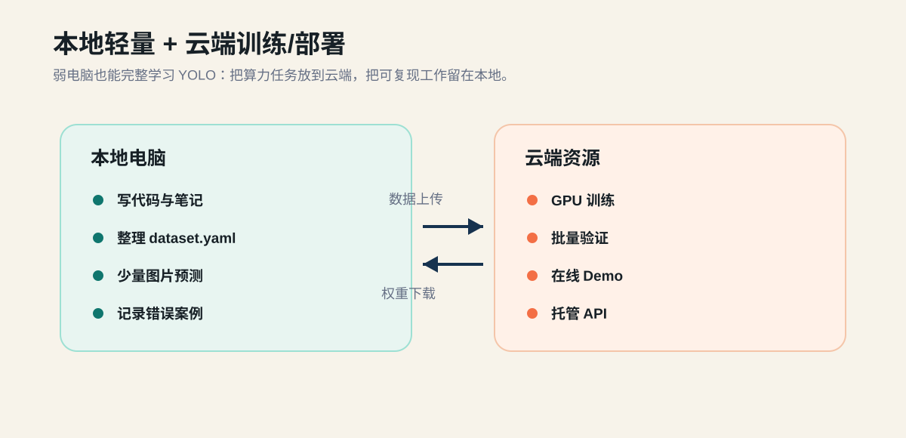

# Lab 00: Local Environment and Course Tools

## Goal

Bring your local machine to a known-good learning state. This lab does not train a model. It proves that you can run course commands, manage the repo, and record environment problems clearly.

## Background

Weak local hardware is fine for this course. The local machine is used for code, notes, dataset bookkeeping, and small prediction tests. Training and heavy evaluation can move to Colab or another cloud GPU later.



## Tasks

1. Confirm your Python executable:

```powershell
python --version
where.exe python
```

If `where.exe python` shows only a WindowsApps path, install Python from python.org or Miniconda and try again.

2. Create and activate a virtual environment:

```powershell
python -m venv .venv
.\.venv\Scripts\Activate.ps1
python -m pip install -U pip
pip install -r requirements.txt
```

3. Run the environment checker:

```powershell
python scripts/check_environment.py
```

4. Fill in `submissions/lab00/environment.md`.
5. Put the number of hours spent in `submissions/lab00/time.txt`.

## Hints

- It is acceptable if CUDA is not available.
- It is acceptable if local inference is slow.
- Do not skip recording failures; the record is part of the lab.

## Grade

```powershell
python tools/course.py grade lab00
```

## Submit

```powershell
python tools/course.py handin lab00
```
