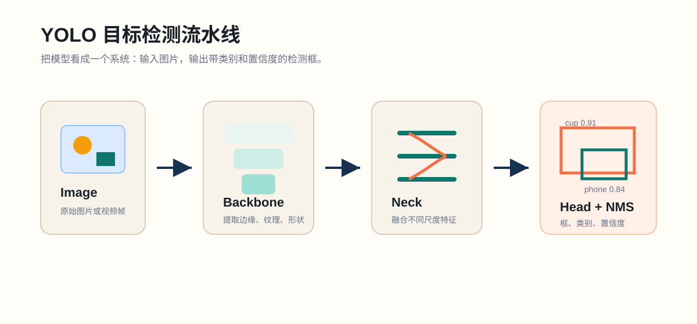

# Lab 02: Pretrained Prediction on a Weak Local Machine

## Goal

Run pretrained YOLO prediction locally in the lightest useful way. The aim is not speed; the aim is to understand inputs, outputs, confidence thresholds, and local hardware limits.

## Background

Ultralytics YOLO prediction accepts many source types: image files, folders, URLs, videos, arrays, and webcam index `0`. For weak machines, start with image folders, small input sizes, and nano weights.



## Tasks

1. Put 5-10 small images in `data/samples/`.
2. Run prediction at a small image size:

```powershell
python scripts/predict_image.py --source data/samples --model yolo11n.pt --imgsz 320 --conf 0.25
```

3. Repeat with a higher threshold:

```powershell
python scripts/predict_image.py --source data/samples --model yolo11n.pt --imgsz 320 --conf 0.50
```

4. Compare false positives, false negatives, and missed small objects.
5. Fill in `submissions/lab02/predict_report.md`.
6. Record time spent in `submissions/lab02/time.txt`.

## Hints

- If prediction is slow, that is data: record it.
- If weights cannot download, try Colab and record the blocker.
- Do not test webcam first; still images are easier to debug.

## Grade

```powershell
python tools/course.py grade lab02
```

## Submit

```powershell
python tools/course.py handin lab02
```
