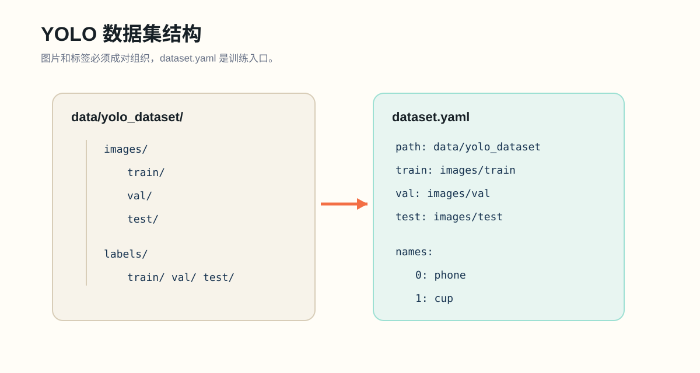

# Lab 03: YOLO Dataset Construction and Audit

## Goal

Build the first version of your custom detection dataset and verify that its structure is trainable.

## Background

YOLO detection training depends on a strict relationship between images, labels, and `dataset.yaml`. A weak model trained on clean labels often beats a larger model trained on confused data.



## Tasks

1. Choose 1-3 classes.
2. Collect an initial set of images. For a first pass, 50-200 images is enough.
3. Annotate bounding boxes with Roboflow, CVAT, Label Studio, or a similar tool.
4. Export in YOLO format.
5. Place files under `data/yolo_dataset/`.
6. Create `data/yolo_dataset/dataset.yaml`.
7. Run:

```powershell
python scripts/inspect_dataset.py --data data/yolo_dataset/dataset.yaml
```

8. Fill in `submissions/lab03/dataset_audit.md`.
9. Record time spent in `submissions/lab03/time.txt`.

## Hints

- Empty images are allowed, but understand how your tool represents them.
- Keep class definitions narrow and visual.
- Check whether labels are normalized from 0 to 1.

## Grade

```powershell
python tools/course.py grade lab03
```

## Submit

```powershell
python tools/course.py handin lab03
```
